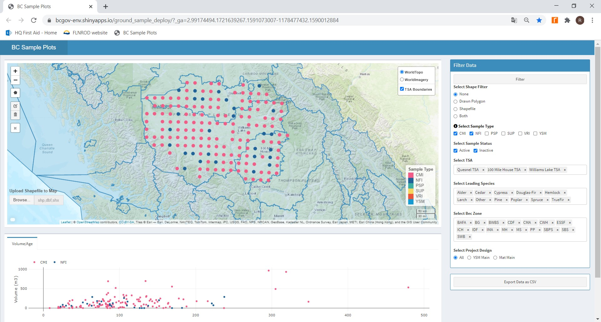
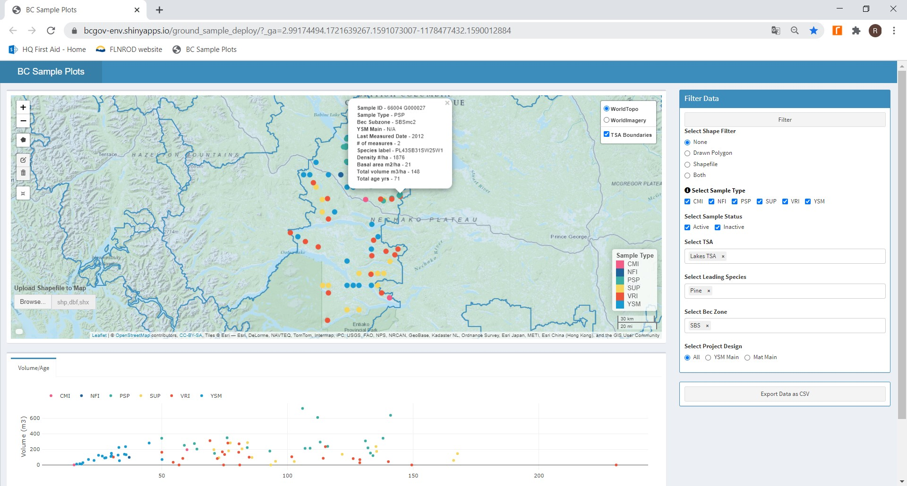
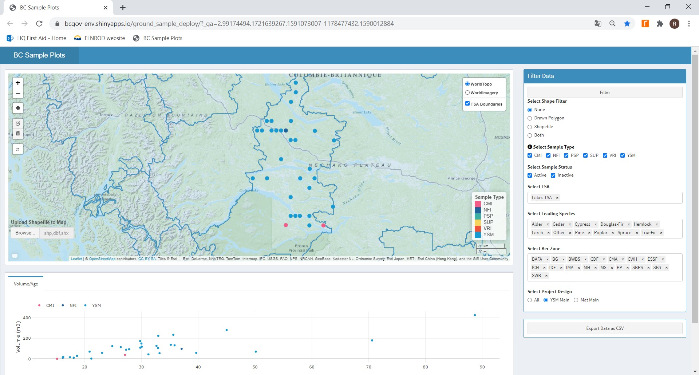
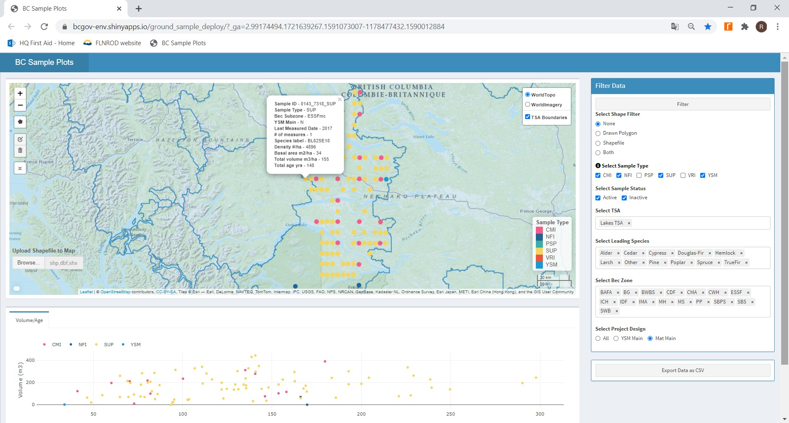
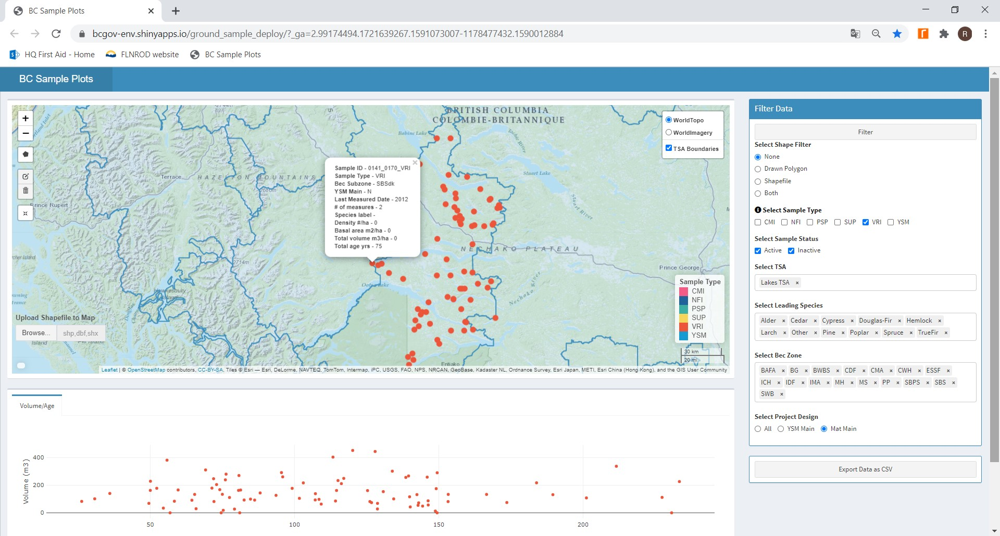

# **Background**
The Forest Analysis and Inventory Branch (FAIB) of B.C.’s Ministry of Forests, Lands, Natural Resource Operations and Rural Development is responsible for coordinating and managing data collection and analyses from a range of different ground sampling programs. 
Permanent Sample Plots (PSPs) provide long-term growth and yield information to support development and testing of growth-and-yield models.  Monitoring Programs including the Provincial Change Monitoring Inventory (CMI), Provincial Young Stand Monitoring (YSM) and National Forest Inventory (NFI) programs, monitor changes in growth, mortality and forest health from statistically valid populations.  Vegetation Resource Inventory (VRI) ground samples are used to audit and verify key spatial inventory attributes estimated during photo interpretation.  Collectively these programs provide valuable ground-based information for applications both within and outside government in assisting sustainable forest management decisions.

# **Open Data**
All posted ground sample data are located on public land, maintained by FAIB, and are approved as Open Data in the BC Data Catalogue.  A series of plot level compiled attributes are available for each ground sample across repeated measurements, and summarized across a series of utilization limits.  The grid-based ground sample programs have their location co-ordinates generalized to the nearest kilometre, while the other programs include detailed location information.

# **Purpose of Web App**
FAIB has developed a publicly accessible Geographic Information Systems (GIS) platform that hosts these data, provides custom queries for specific areas of interest, and provides download capability for compiled ground sample information.  

# **Features**
A series of user-controlled filtres provides for custom queries and data export.  The results of a given query is displayed as ground sample plot location on a scale-able provincial map, and as a graph of compiled volume over age of all samples in the query.  User controlled filters include selection by ground sample type, Timber Supply Area (TSA), Biogeoclimatic Ecosystem Classification Zone, Leading species of the compiled sample data.  Alternatively, a selected area can be created on the map, or a spatial boundary can be imported for clipping.  At any ground sample location, the description and summary of compiled attributes can also be viewed.

# **Exported Data**
When ‘export data as CSV’ is selected, the compiled plot attributes of the queried set of samples is exported to a CSV formatted file.  Two files are created: 

BC_SAMPLE_DATA.CSV: 
Each record contains the plot level compiled attributes (standardized to a per hectare basis), for each measurement date for a given sample.  At each measurement, the data are compiled to five individual minimum diameter at breast height (DBH) utilization limits (i.e. 4.0, 7.5, 12.5, 17.5, 22.5), with each utilization limit reported on a separate record.

DATA_DICTIONARY.CSV:  
The full list of attributes included in BC_SAMPLE_DATA.CSV is described in this data dictionary.

# **References**
Further information on FAIB’s ground sampling program, and available reports, can be found at:
Resource Information on Provincial Monitoring Program:
[link](https://www2.gov.bc.ca/gov/content/industry/forestry/managing-our-forest-resources/forest-inventory/ground-sample-inventories/provincial-monitoring)
YSM Technical Handouts for all available TSAs
…link to be added
Mature Stand Assessment Technical Handouts for all available TSAs
… link to be added

# **Example Queries**
A series of example queries are illustrated (following pages) to assist users with navigating the Web App and accessing data of interest.
 
### **1. All monitoring ground samples on the 20km x 20km NFI grid established to date in the Cariboo TSAs.**  
Under select TSA, press the box ‘clear all’, then select ‘QUESNEL’, ‘WILLIAMS LAKE’, and ‘100 MILE HOUSE’.  Under select sample type choose (CMI & NFI).  Press FILTER. 
______________________________________________________________________________________________________________________________________________________________________

### **2. All Pine-leading ground samples (of all sample types) in the SBS BGC zone of the Lakes TSA.**
Under select TSA, press the box ‘clear all’, then type ‘LAKES’.  Under select leading species, press the box ‘clear all’, then type PINE.  Under select BEC zone, press the box ‘clear all’, then type SBS.  Press FILTER.  Zoom in the map to display point features.  For added clarity, click ‘TSA Boundaries’ located at the map upper right corner to show all TSA administrative boundaries.  Clicking any given sample point will display the ground sample description and compilation summaries.
______________________________________________________________________________________________________________________________________________________________________

### **3. All grid-based samples that collectively make up the YSM sampled population in the Lakes TSA.** 
Under select TSA, press the box ‘clear all’, then type ‘LAKES’.  Under select project design choose (YSM_MAIN).  Press FILTER.  Zoom in the map to display point features.  To export compiled plot level summaries, press export data as CSV.  (Note, YSM is an intensification of the NFI grid, and intersects with other sample types (CMI & NFI) that serve multiple programs, therefore the separate filter ‘YSM_MAIN’ must be used over just sample type, to select all grid-based samples in the mapped young stand population).

### **4. All grid-based samples that collectively make up the Mature sampled population in the Lakes TSA.** 
Under select TSA, press the box ‘clear all’, then type ‘LAKES’.  Under select sample type choose (CMI, NFI, SUP, YSM).  Under select project design choose (MAT_MAIN).  Press FILTER.  Zoom in the map to display point features.  To export compiled plot level summaries, press export data as CSV.  (Note, The Lakes TSA grid-based mature sampled population is based on an intensification of the NFI grid at 10km * 20km, and includes multiple grid-based ground samples; therefore the separate filter ‘MAT_MAIN’ must be used over just sample type, to select all grid based samples in the mapped mature population of stands >50 years old).

### **5. All PPSWR-based samples that make up the Mature sampled population in the Lakes TSA.** 
Under select TSA, press the box ‘clear all’, then type ‘LAKES’.  Under select sample type choose (VRI).  Under select project design choose (MAT_MAIN).  Press FILTER.  Zoom in the map to display point features.  To export compiled plot level summaries, press export data as CSV.  (Note, The Lakes TSA ppswr-based mature sampled population is based on a previous sample design that randomly picked ground samples proportional to polygon size with replacement.  Inclusion of the separate filter ‘MAT_MAIN’ further subsets the data to just those samples that are in the mapped mature population >50 years old.

